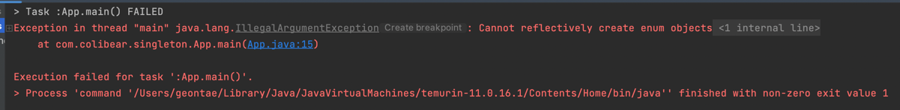

> [인프런 - (백기선) 코딩으로 학습하는 GoF 디자인 패턴](https://inflearn.com/course/디자인-패턴/dashboard)

# GoF 디자인 패턴(1) - Singleton

## 1. 싱글톤 패턴이란

> 인스턴스를 `오직 한 개`만 제공하는 클래스

- 시스템 런타임, 환경 세팅에 대한 정보 등, 인스턴스가 여러개 일 때 문제가 생길 수 있는 경우 인스턴스를 `오직 한 개`만 만들어 `제공`하는 클래스가 필요한 경우 사용한다.

## 2. 싱글톤 패턴을 가장 단순히 구현하는 방법

- 다음은 싱글톤을 구현하는 가장 단순한 방법으로 `private constructor`와 `static field`, `static method`를 이용해서 구현하는 방법이다.

```java
package com.colibear.singleton;

public class Settings {

    // 외부에서는 인스턴스에 접근이 불가능 하다.
    // 따라서 글로벌하게 접근 가능하도록 만들어야 한다.
    private Settings() {
    }

    // newInstance 를 사용하면 항상 다른 인스턴스가 생성되므로 다음과 같은 방법을 사용해
    // 항상 동일한 인스턴스를 가져오는것을 보장해 준다.
    public static Settings newInstance() {
        return new Settings();
    }

    private static Settings instance;

    public static Settings getInstance() {
        if (instance == null) {
            instance = new Settings();
        }

        return instance;
    }


}

```

## 3. 멀티 쓰레드 환경에서 안전하게 싱글톤 패턴을 구현하는 방법

- 위 코드는 사실 멀티 스레드 환경에서는 안전하지 않다.
- 예를 들어 두 개의 쓰레드가 동시에 해당 메서드에 접근하게 되면 `A Thread` 가 인스턴스를 생성하기 전에 `B Thread`가 인스턴스의 `null` 체크를 진행하게 되면 충돌이 날 수 있다.

### 3.1 Synchronized

- `synchronized` 키워드를 이용하여 해당 메서드에 한 번에 하나의 쓰레드만 접근 가능하도록 할 수 있다.

```java
package com.colibear.singleton;

public class Settings {
    private static Settings instance;

    public static synchronized Settings getInstance() {
        if (instance == null) {
            instance = new Settings();
        }

        return instance;
    }
}
```

- 단, 해당 메서드에 접근할때 동기화 처리해야하는 작업 때문에 성능에 불이익이 있을 수 있다. (동기/비동기를 알아보자)

### 3.2 eager initialization

- 성능을 신경쓰고, 객체를 만드는 비용이 비싸지 않거나 나중에 만들지 않아도 되는 경우에는 아래와 같은 방법을 사용해도 된다.

```java
public class Settings {
    private static Settings INSTANCE = new Settings();

    public static synchronized Settings getInstance() {
        return INSTANCE;
    }
}
```

- 이른 초기화라고도 하며, 이 방법은 생성된 인스턴스를 반환해주기만 하기 때문에 `thread safe` 하다.
- 만약 생성 과정이 길고, 메모리, cpu등 리소스 비용이 높은데 사용 빈도가 낮으면 불 필요한 비용이 발생하기 때문에 오히려 안좋을 수 있다.

### 3.3 double checked locking

- 인스턴스를 사용이 될때 만들고 싶으나 `syncronized` 비용이 신경 쓰이는 경우 사용한다.

```java
public class Settings {
    private static volatile Settings instance;

    public static synchronized Settings getInstance() {
        if (instance == null) {
            synchronized (Settings.class) {
                if (instance == null) {
                    instance = new Settings();
                }
            }
        }
        return instance;
    }
}
```

- 위 코드는 1.5 이상에서만 동작하고, `volatile` 키워드를 왜 사용하고 어떻게 동작하는지에 대해 설명하자면 굉장히 복잡하다고 한다.
- 복잡하지 않고 깔끔하게 작성하는 방법을 아래에서 알아보자. 이것은 권장하는 방법중 하나이다.

### 3.4 static inner class

```java
public class Settings {
    private Settings() {
    }

    private static class SettingsHolder {
        private static final Settings INSTANCE = new Settings();
    }

    public static Settings getInstance() {
        return SettingsHolder.INSTANCE;
    }
}
```

- 위 코드는 멀티 스레드 환경에서도 안전하며, `getInstance()`가 호출 될 때 `SettingsHolder`를 통해서 호출하게 되면서 내부에서 인스턴스를 생성하므로 안전하며 권장하는 방법중에 하나이다.

## 4. 싱글턴 패턴 구현 방법을 깨트리는 방법

- 강사님이 강의에서 Settings 의 인스턴스를 깨트려 보라고 해서 한번 해보았다.

### 4.1 내가 만든 코드

```java
public class App {
    public static void main(String[] args) throws InvocationTargetException, InstantiationException, IllegalAccessException {
        Settings settings = Settings.getInstance();

        Constructor<?>[] declaredConstructors = Settings.class.getDeclaredConstructors();
        Constructor<?> constructor = Arrays.stream(declaredConstructors).findFirst().get();
        constructor.setAccessible(true);
        Settings settings1 = (Settings) constructor.newInstance();

        System.out.println("(settings1 == settings) = " + (settings1 == settings));
    }
}
```

### 4.2 리플렉션

```java
import java.lang.reflect.Constructor;

public class App {
    public static void main(String[] args) throws InvocationTargetException, InstantiationException, IllegalAccessException {
        Settings settings = Settings.getInstance();

        //  getDeclaredConstructor() 이거 없는데요..? -> getDeclaredConstructors()
        Constructor<Settings> constructor = Settings.class.getDeclaredConstructor();
        constructor.setAccessible(true);
        Settings settings1 = constructor.newInstance();
    }
}

```

### 4.3 직렬화와 역직렬화

- 역직렬화 하는 경우 반드시 생성자를 사용해서 인스턴스를 만들어 주기 때문에 `false`가 나오게 된다.

```java
public class Settings implements Serializable {
    private Settings() {
    }

    private static class SettingsHolder {
        private static final Settings INSTANCE = new Settings();
    }

    public static Settings getInstance() {
        return SettingsHolder.INSTANCE;
    }
}


public class App {
    public static void main(String[] args) throws IOException, ClassNotFoundException {
        Settings settings = Settings.getInstance();
        Settings settings1 = null;
        // 직렬화
        try (ObjectOutput out = new ObjectOutputStream(new FileOutputStream("settings.obj"))) {
            out.writeObject(settings);
        }

        // 역직렬화
        try (ObjectInput in = new ObjectInputStream(new FileInputStream("settings.obj"))) {
            settings1 = (Settings) in.readObject();
        }
        System.out.println("(settings == settings1) = " + (settings == settings1));
    }
}
```

#### 4.3.1 역직렬화 대응 방안

- 원래는 `new Settings`를 하게 되지만 `protected Object readResolve()`를 가지고 있으면 역직렬화를 할때 반드시 `readResolve`를 호출하게 된다.

```java
public class Settings implements Serializable {
    private Settings() {
    }

    private static class SettingsHolder {
        private static final Settings INSTANCE = new Settings();
    }

    public static Settings getInstance() {
        return SettingsHolder.INSTANCE;
    }

    protected Object readResolve() {
        return getInstance();
    }
}
```


- 역직렬화는 대응이 가능하나 리플렉션은 대응이 불가능하다. 따라서 아래에서 리플렉션 방어 방법을 정리해보자

## 5. 안전하고 단순하게 구현하는 방법

### 5.1 enum

```java
public enum Settings {
    INSTANCE;
}

public class App {
    public static void main(String[] args) throws InvocationTargetException, InstantiationException, IllegalAccessException {
        Settings settings = Settings.INSTANCE;

        Constructor<?>[] declaredConstructors = Settings.class.getDeclaredConstructors();
        Constructor<?> constructor = Arrays.stream(declaredConstructors).findFirst().get();
        constructor.setAccessible(true);
        Settings settings1 = (Settings) constructor.newInstance();

        System.out.println("(settings == settings1) = " + (settings == settings1));

    }
}

```



- `enum`도 생성자, 메서드, 필드 등을 모두 선언할 수 있고, 리플렉션으로 절대 뚫을수가 없어 안전하다.
- 단점은 미리 만들어 준다는 거다.(클래스를 사용하는 순간)
- 직렬화, 역직렬화에서도 안전하다. 
  - 상수의 순서를 보장하기 때문에

## 6. 복습

### 6.1 자바에서 enum을 사용하지 않고 싱글톤 패턴을 구현하는 방법

### 6.2 private 생성저와 static 메소드를 사용하는 방법의 단점

### 6.3 enum을 사용해 싱글톤 패턴을 구현하는 방법의 장점과 단점

### 6.4 static inner 클래스를 사용해 싱글톤 패턴을 구현

## 7. 자바와 스프링에서 찾아보는 싱글턴 패턴

### 7.1 Runtime

### 7.2 ApplicationContext